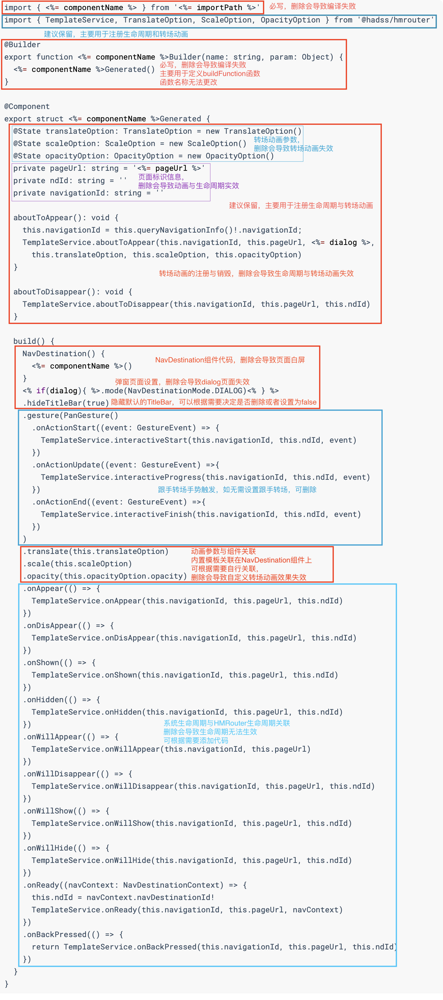

# HMRouterPlugin 自定义模板使用说明

## 简介

`HMRouterPlugin`集成了[EJS模板引擎](https://github.com/mde/ejs)，用于生成页面代码、路由配置等，并在`1.0.0-rc.7`版本后开放模版的自定义功能。

## 主要功能

- **EJS 模板解析**：集成了 EJS 模板引擎，可以基于模板和数据模型生成动态页面或代码。
- **路由表生成**：根据开发者配置的装饰器自动生成路由配置。
- **页面代码生成**：自动生成`NavDestination`页面代码，开发者只需要关注页面内容。

## 自定义模板配置

```json5
{
  // 如果不配置则扫描src/main/ets目录，对本模块代码进行全量扫描，如果配置则数组不能为空，建议配置指定目录可缩短编译耗时
  "scanDir": [
    "src/main/ets/components/**",
    "src/main/ets/interceptors/**"
  ],
  "saveGeneratedFile": false, // 默认为false，调试排除错误时可以改成true，不删除编译产物
  "defaultPageTemplate": "./templates/defaultTemplate.ejs", // 默认模板文件，不配置时使用插件内置模板
  // 特殊页面模版文件，匹配原则支持文件通配符
  "customPageTemplate": [
    {
      "srcPath": ["**/component/Home/**/*.ets"],
      "templatePath": "./templates/home_shopping_template.ejs"
    },
    {
      "srcPath": ["**/common/**/*.ets"],
      "templatePath": "./templates/common_template.ejs"
    },
    {
      "srcPath": ["**/live/**/*.ets"],
      "templatePath": "./templates/live_template.ejs"
    }
  ]
}
```

### EJS 模板使用

在 `HMRouterPlugin` 中，EJS 模板用于生成动态页面或组件，你可以在模板文件中使用 EJS 的语法

> EJS语法可阅读参考[官网链接](https://github.com/mde/ejs)

**模板文件示例：**

```ejs
import { <%= componentName %> } from '<%= importPath %>'

@Builder
export function <%= componentName %>Builder(name: string, param: Object) {
  <%= componentName %>Generated()
}

@Component
export struct <%= componentName %>Generated {
  private pageUrl: string = '<%= pageUrl %>'

  build() {
    NavDestination() {
      <%= componentName %>()
    }
    <% if(dialog){ %>.mode(NavDestinationMode.DIALOG)<% } %>
    .hideTitleBar(true)
  }
}
```

> 模板文件中至少需要包含`NavDestination`组件代码和相对应的`build`函数，缺少会导致编译失败或者页面白屏，插件中会内置一套默认模板，其中包含了**页面展示、生命周期注册、转场动画注册**

### 默认模板介绍

插件会根据如下默认模板来生成`NavDestination`页面代码，如有自定义模板的需求，建议先阅读下面内置模板的介绍在做更改，书写自定义模板时建议在内置模板基础上添加代码，删除内置模板相关代码可能会导致**编译失败、生命周期生效、转场动画失效等问题**，详情介绍见下图：



**默认模版`viewBuilder.ejs`：**

```ejs
import { <%= componentName %> } from '<%= importPath %>'
import { TemplateService, TranslateOption, ScaleOption, OpacityOption } from '@hadss/hmrouter'

@Builder
export function <%= componentName %>Builder(name: string, param: Object) {
  <%= componentName %>Generated()
}

@Component
export struct <%= componentName %>Generated {
  @State translateOption: TranslateOption = new TranslateOption()
  @State scaleOption: ScaleOption = new ScaleOption()
  @State opacityOption: OpacityOption = new OpacityOption()
  private pageUrl: string = '<%= pageUrl %>'
  private ndId: string = ''
  private navigationId: string = ''

  aboutToAppear(): void {
    this.navigationId = this.queryNavigationInfo()!.navigationId;
    TemplateService.aboutToAppear(this.navigationId, this.pageUrl, <%= dialog %>,
      this.translateOption, this.scaleOption, this.opacityOption)
  }

  aboutToDisappear(): void {
    TemplateService.aboutToDisappear(this.navigationId, this.pageUrl, this.ndId)
  }

  build() {
    NavDestination() {
      <%= componentName %>()
    }
    <% if(dialog){ %>.mode(NavDestinationMode.DIALOG)<% } %>
    .hideTitleBar(true)
    .gesture(PanGesture()
      .onActionStart((event: GestureEvent) => {
        TemplateService.interactiveStart(this.navigationId, this.ndId, event)
      })
      .onActionUpdate((event: GestureEvent) =>{
        TemplateService.interactiveProgress(this.navigationId, this.ndId, event)
      })
      .onActionEnd((event: GestureEvent) =>{
        TemplateService.interactiveFinish(this.navigationId, this.ndId, event)
      })
    )
    .translate(this.translateOption)
    .scale(this.scaleOption)
    .opacity(this.opacityOption.opacity)
    .onAppear(() => {
      TemplateService.onAppear(this.navigationId, this.pageUrl, this.ndId)
    })
    .onDisAppear(() => {
      TemplateService.onDisAppear(this.navigationId, this.pageUrl, this.ndId)
    })
    .onShown(() => {
      TemplateService.onShown(this.navigationId, this.pageUrl, this.ndId)
    })
    .onHidden(() => {
      TemplateService.onHidden(this.navigationId, this.pageUrl, this.ndId)
    })
    .onWillAppear(() => {
      TemplateService.onWillAppear(this.navigationId, this.pageUrl)
    })
    .onWillDisappear(() => {
      TemplateService.onWillDisappear(this.navigationId, this.pageUrl, this.ndId)
    })
    .onWillShow(() => {
      TemplateService.onWillShow(this.navigationId, this.pageUrl, this.ndId)
    })
    .onWillHide(() => {
      TemplateService.onWillHide(this.navigationId, this.pageUrl, this.ndId)
    })
    .onReady((navContext: NavDestinationContext) => {
      this.ndId = navContext.navDestinationId!
      TemplateService.onReady(this.navigationId, this.pageUrl, navContext)
    })
    .onBackPressed(() => {
      return TemplateService.onBackPressed(this.navigationId, this.pageUrl, this.ndId)
    })
  }
}
```

### 模板变量

| 属性                | 描述              |
|-------------------|-----------------|
| pageUrl           | 标签中配置的pageUrl的值 |
| importPath        | 原组件的导入路径        |
| componentName     | 原组件名            |
| dialog            | 是否dialog页面      |
| generatorViewName | 生成的文件名          |

### TemplateService内置模版方法

该类中封装了一系列在模板中需要用到的注册、初始化、事件回调接口

| 接口                         | 参数                                                                                                                                                  | 返回值  | 接口描述                  |
|----------------------------|-----------------------------------------------------------------------------------------------------------------------------------------------------|------|-----------------------|
| static aboutToAppear       | navigationId: string,pageUrl: string, dialog: boolean, translateOption: TranslateOption,   scaleOption: ScaleOption,   opacityOption: OpacityOption | void | 注册接口，用于模板代码中注册动画与生命周期 |
| static aboutToDisappear    | navigationId: string, pageUrl: string, ndId: string                                                                                                 | void | 销毁，用户销毁一个页面的动画与生命周期实例 |
| static onDisAppear         | navigationId: string, pageUrl: string, navId: string                                                                                                | void | NavDestination生命周期    |
| static onAppear            | navigationId: string, pageUrl: string, navId: string                                                                                                | void | NavDestination生命周期    |
| static onShown             | navigationId: string, pageUrl: string, navId: string                                                                                                | void | NavDestination生命周期    |
| static onHidden            | navigationId: string, pageUrl: string, navId: string                                                                                                | void | NavDestination生命周期    |
| static onWillAppear        | navigationId: string, pageUrl: string                                                                                                               | void | NavDestination生命周期    |
| static onWillDisappear     | navigationId: string, pageUrl: string, navId: string                                                                                                | void | NavDestination生命周期    |
| static onWillShow          | navigationId: string, pageUrl: string, navId: string                                                                                                | void | NavDestination生命周期    |
| static onWillHide          | navigationId: string, pageUrl: string, navId: string                                                                                                | void | NavDestination生命周期    |
| static onReady             | navigationId: string, pageUrl: string, navContext: NavDestinationContext                                                                            | void | NavDestination生命周期    |
| static onBackPressed       | navigationId: string, pageUrl: string, navId: string                                                                                                | void | NavDestination生命周期    |
| static interactiveStart    | navigationId: string, ndId: string, event: GestureEvent                                                                                             | void | 手势转场动画触发              |
| static interactiveFinish   | navigationId: string, ndId: string, event: GestureEvent                                                                                             | void | 手势转场动画更新              |
| static interactiveProgress | navigationId: string, ndId: string, event: GestureEvent                                                                                             | void | 手势转场动画结束              |
