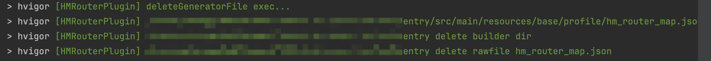

# HMRouter常见问题及FAQ


# 编译期常见问题

## **正常编译通过的场景**

  一次正常的编译应该包含如下两个任务`HMRouterPluginTask,CopyRouterMapToRawFileTask`以及相关的编译日志

1. 描述本工程中有哪些模块配置了插件任务
   


2. `HMRouterPluginTask`任务执行日志，描述当前模块中扫描了哪些文件，生成了哪些文件，当前任务执行耗时打点


3. `CopyRouterMapToRawFileTask`任务执行日志


4. 任务执行结束删除生成产物，如果配置文件中`saveGeneratedFile`为`true`，则不删除当前模块生成产物
   



  每一次正常的编译，每个模块都应该包含上面的日志


## **常见异常场景**

1. 装包失败场景

下面为正常装包成功的日志
    

    
场景异常场景有如下几种：
    

* 版本号错误，如下所示日志，检查版本号即可
  


    
* npm镜像无效，出现xxx Not Found - 404一般为npm镜像无效问题，建议按照[官网镜像](https://developer.huawei.com/consumer/cn/doc/harmonyos-guides-V5/ide-environment-config-V5#section197296441787)配置
  


    
2. 编译失败场景
   

插件有几种异常检测会主动抛出异常，详情请见[错误码](https://gitee.com/hadss/hmrouter/blob/dev0830/docs/Reference.md#%E9%94%99%E8%AF%AF%E7%A0%81)，如出现如下类似的系统错误日志，请检查下IDE版本，目前已知Build Version: 5.0.3.600版本会偶现该问题，可升级版本解决
    
```txt
hvigorERROR: Duplicate 'routerMap' object names detected.
     
* Try the following:
> Change the 'routerMap' object names listed below under routerMap in the respective router configuration files. Make sure the names are unique across the current module and the modules on which it depends.
{"home":["BootView"]}
```


# 运行时常见问题

插件编译通过，启动app出现白屏

  首先排除编译日志，是否是一次正常的编译，如果缺失某些日志，可能是插件配置错误，请检查模块的`hvigorfile.ts`文件是否正确配置

  

页面正常加载，正常跳转，生命周期/拦截器/动画无效

  打开`hilog`日志，观察是否出现如下异常

  

  如出现，请检查工程级别的`build-profile.json5`文件配置，红框标注的配置项必选

  
页面正常加载，正常跳转，部分生命周期/拦截器/动画无效


打开hilog日志，观察是否出现如下异常，关键错误码**40005008**

```text
[HMRouter ERROR]ERR_DYNAMIC_IMPORT_FAILED 40005008 动态加载失败 - entry/src/main/ets/lifecycle/WelcomeLifecycle - com.huawei.hadss.hmrouter/entry - WelcomeLifecycle
```


如果出现，请检查对应的类是否导出


# 常见错误码及排查方法

## 错误码:40005008
表示使用动态加载的时候出现问题，请检查下面的配置是否正确
1. build-profile.json5中需要将useNormalizedOHMUrl配置为true
2. 根据hilog找到对应的动态加载失败的代码位置，查看对应的类是否导出

如果错误未在上面的场景中列出，请参考动态加载原理中 **1.3 HMRouter动态加载**  章节原理进行排查
[动态加载原理](https://gitee.com/hadss/hmrouter/wikis/HMRouter%E5%8A%A8%E6%80%81%E5%8A%A0%E8%BD%BD%E5%8E%9F%E7%90%86%E4%BB%8B%E7%BB%8D)


# FAQ

## 问题:是否支持启动框架初始化HMRouter
支持，需要升级到1.0.0release以上版本，详细使用文档请参考。
[启动框架使用介绍](https://gitee.com/hadss/hmrouter/wikis/%E5%A6%82%E4%BD%95%E5%9C%A8%E5%90%AF%E5%8A%A8%E6%A1%86%E6%9E%B6%E4%B8%AD%E5%88%9D%E5%A7%8B%E5%8C%96HMRouter)

## 问题:HMRouter中根容器是NavDestination,项目中原有的SettingPage的根容器也是NavDestination，无法展示返回按钮
当前HMRouter标签暂时无法与NavDestination共用，生成代码默认会hidetitlebar，如果需要使用原生NavDestination的属性，可以使用registerPageBuilder接口注册。

原始Issues地址[Issues](https://gitee.com/hadss/hmrouter/issues/IAOIFZ)

##  问题: 路由嵌套情况下，路由发生跳转时，不是所期望的路由栈

**建议措施**：当发生上述问题时，建议在路由操作时，传入需要跳转的路由栈对应的navigationId。

**问题原因**：HMRouter提供的push/pop/replace接口默认可以不用传navigationId；当工程中只有一个HMNavigation时，不传navigationId做路由跳转不会存在问题；而当存在路由嵌套情况下，使用HMRouter作为路由跳转时，如果不传navigationId，框架会通过规则去查找；

**当前规则**：框架会自动记录上一次push/pop/replace操作时，所触发的路由栈对应的navigationId, 以及创建HMNavigation时所传入的navigationId；当使用接口跳转且未传navigationId的情况下，会查找最近一次记录的navigationId。

## 问题：生命周期里面获取到的数据怎么传递给页面

可以通过**HMRouterMgr.getcurrentlifecycleowner?.getlifecycle**方法获取当前的生命周期实例来获取数据，参考如下的代码

``` ts
 let model = (HMRouterMgr.getCurrentLifecycleOwner()?.getLifecycle() as ExitPayDialog).model
 model.pageUrl = this.pageUrl
```

